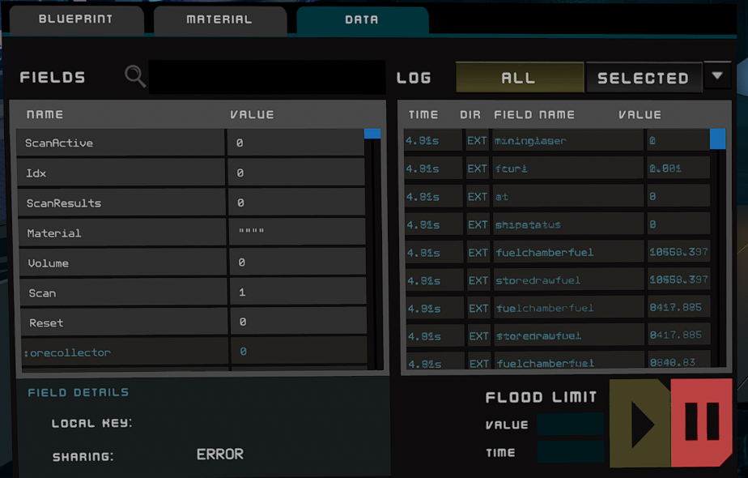
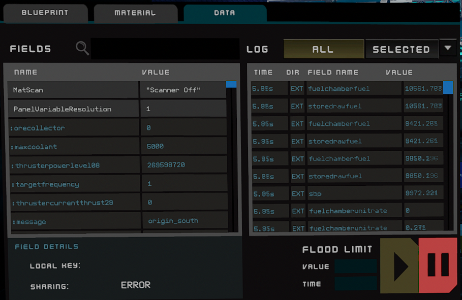
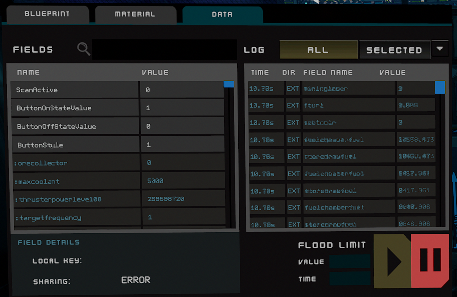

## Scipt run down:

### Line 1:
will check if the button’ScanActive’ has been pressed. If not it does a tight loop on line 1 so it can respond quickly once the button is pressed. Once it’s pressed it preps the scanner by turning it on, resetting to to do a scan, initializing the index(idx) to 0, and finally clears the “Framebuffer” which is the variable ‘out’

### Line 2:
checks to see if the scanner sees something to scan. If it doesn’t then it sets our frame buffer to ‘No Results’ then goes to line 5

### Line 3:
will check to see if we’ve gone through all the indexes. If so then go to line 5 otherwise it will run the next line.

### Line 4:
takes the material name and amount of that material and adds it to our frame buffer, this information is gathered from the index (idx) we initialized in line 1 Then it adds one to the index and goes to line 2 to check if it’s still looking at an scannable item (we do this incase we pass over something we don’t get caught processing something we are no longer pointed at. It will then loop from line 2 to line 4 until it’s gathered all the materials in that object we’re scanning. 

### Line 5:
the takes our frame buffer and displays it to the screen named ‘MatScan’. Then looping back to line 1 starting the process over. 

### Line 6:
gets displayed when the scanner button is turned off.

## Device Field names
These are screen shots of the device field names to help set it up.

# Material Point Scanner

# Text display

# Button to activate

